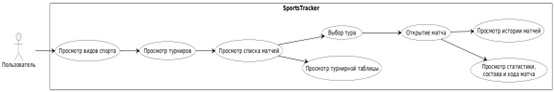
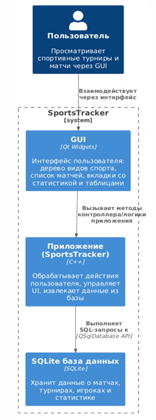
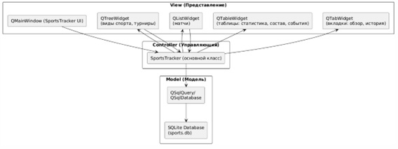
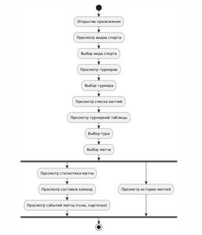

# SportsTracker

Приложение для анализа спортивных результатов с возможностью просмотра турнирных таблиц, статистики матчей и истории встреч команд.

## Основные возможности

- Просмотр списка видов спорта и турниров
- Отображение турнирной таблицы с цветовой индикацией позиций
- Просмотр матчей по турам
- Детальная статистика матчей:
  - Основные показатели (владение мячом, удары и т.д.)
  - Составы команд (основные и запасные игроки)
  - Ход матча (голы, карточки, замены)
  - История последних матчей команд
  - История очных встреч
- Удобный интерфейс с вкладками и навигацией

## Технологии

- Язык программирования: C++
- Фреймворк: Qt 6 (Widgets, SQL)
- База данных: SQLite
- Система сборки: CMake

## Системные требования

- macOS, Windows или Linux
- Qt 6.5+
- CMake 3.16+
- Компилятор с поддержкой C++17

## Архитектура и диаграммы системы

### 1. Диаграмма активностей (Activity Diagram)
Описание:
Диаграмма активностей иллюстрирует процесс взаимодействия пользователя с приложением. Она показывает цепочку действий, начиная с открытия приложения, выбора вида спорта, турнира, просмотров и заканчивая детализацией матчей и статистики. Это помогает понять, как пользователь переходит от одного действия к другому.

  
*Рис. 1. Последовательность действий пользователя в приложении*

### 2. C4 Container Diagram
Описание:
Диаграмма C4 Container пказывает контейнеры системы: приложение SportsTracker (GUI и C++) и SQLite. Иллюстрирует взаимодействие через сигналы/слоты и потоки данных.

  
*Рис. 2. Архитектурная диаграмма системы в нотации C4*

### 3. MVC Architecture
Описание:
Диаграмма MVC архитектуры демонстрирует распределение логики приложения на три ключевых компонента: Модель, Представление и Контроллер. Модель управляет данными (например, SQLite), Представление отвечает за отображение данных (например, QWidgets), а Контроллер осуществляет связь между ними, обрабатывая действия пользователя и обновляя интерфейс.

  
*Рис. 3. Взаимодействие компонентов по паттерну Model-View-Controller*

### 4. Use Case Diagram
Описание:
Диаграмма вариантов использования показывает взаимодействие пользователя с функциональностью системы. Она выделяет ключевые действия, такие как выбор турнира, просмотр таблиц и деталей матчей. Это позволяет понять, какую ценность система предлагает конечному пользователю и какие основные сценарии использования программного обеспечения.

  
*Рис. 4. Диаграмма вариантов использования системы*
